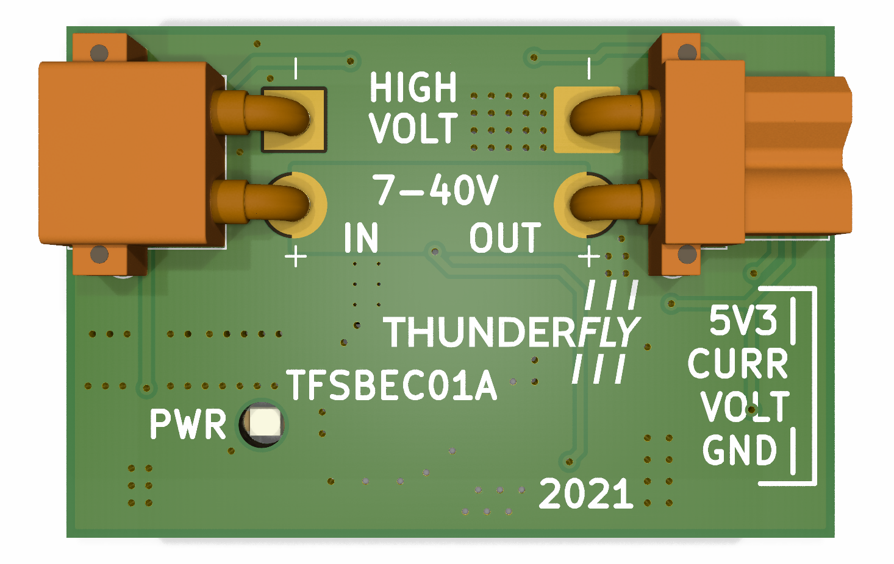
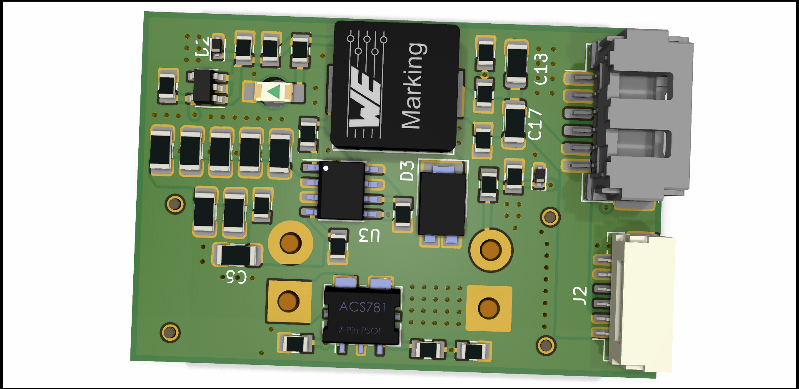

# TFSBEC01 - High efficient power supply with measuring circuit for UAV

There are many devices in unmanned vehicles that require a quality power supply, and it is very useful to know the actual and real consumption of these components. Our TFSBEC module is designed to provide power to servos, autopilot (flight controller), and other drone accessories. In case the user needs more current or two independent sources on his drone, for example, a separate source for avionics and for power-consuming elements (actuators), it is possible to chain these modules.

## Parameters

| Parameter | Value | Note |
|------|------|---------|
| Regulator technology | Switched step-down| [LMR14050](https://www.ti.com/lit/ds/symlink/lmr14050.pdf)|
| Input voltage | 6 - 40 V  | Equivalent of 2S to 9S li-pol  accumulators |
| Output voltage | 5.4 V, 5 A | based form the PX4 standard, can be adjusted |
| Regulated connector | Molex Click-n-mat 6p, JST-GH 6p | Connectors are parallel |
| In/Out connector | XT30 | max current xx A |
| Current measurement range | | |
| Volts per Amper | | |
| Voltage measurement range | | |
| Size | | PCB only |
| Weight | | PCB only |
| Compatibility | Pixhawk-based drones | As a quality source, it can be operated on any drone |
