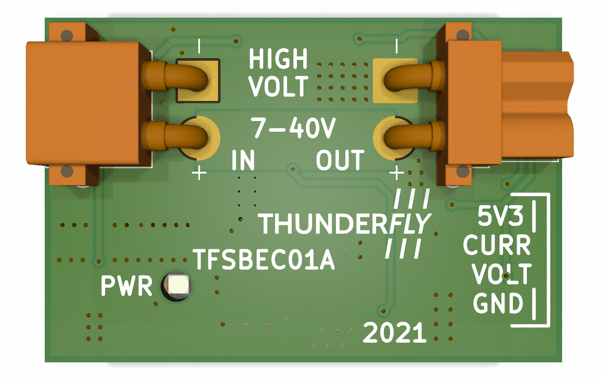
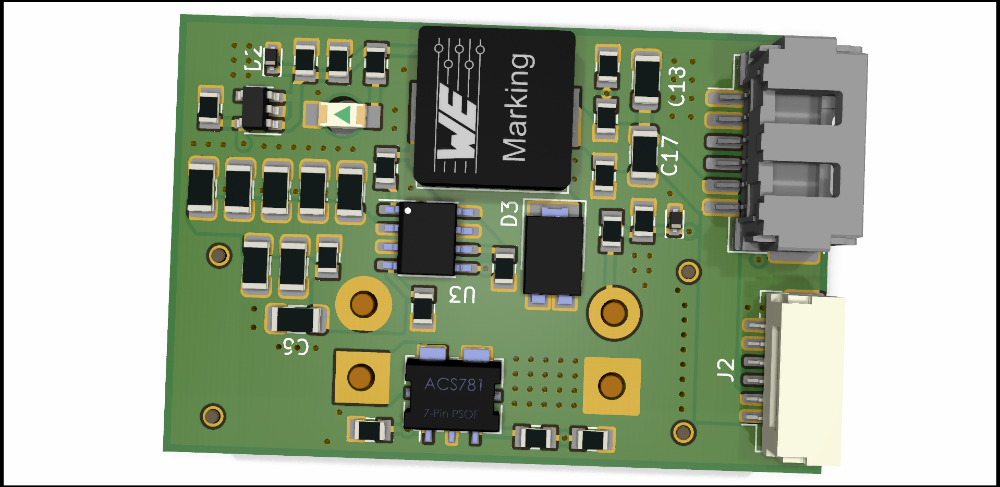

# TFSBEC01 - High efficient power supply with measuring circuit for UAV

There are many devices in unmanned vehicles that require a quality power supply, and it is very useful to know the actual and real consumption of these components. Our TFSBEC module is designed to provide power to servos, autopilot (flight controller), and other drone accessories. In case the user needs more current or two independent sources on his drone, for example, a separate source for avionics and for power-consuming elements (actuators), it is possible to chain these modules.

## Parameters

| Parameter | Value | Note |
|------|------|---------|
| Regulator technology | Switched step-down| [LMR14050](https://www.ti.com/lit/ds/symlink/lmr14050.pdf)|
| Input voltage | 6 - 40 V  | Equivalent of 2S to 9S li-pol  accumulators |
| Output voltage | 5.4 V, 5 A | based form the PX4 standard, can be adjusted |
| Regulated connector | Molex Click-n-mat 6p, JST-GH 6p | Connectors are parallel |
| In/Out connector | XT30 | max current 15 A |
| Current measurement range | 0 - 50 A | |
| Volts per Amper | 39.6 mV/A | From component datasheet |
| Current measurement Volts offset | 330 mV | From component datasheet |
| Voltage measurement range | 0 - 40 V | Depend on target ADC max input ( max. 3.95 V ) |
| Voltage measurement divider | 10.13 | From schematic |
| Size | approx. 46 x 30 mm| PCB only |
| Weight | | PCB only |
| Compatibility | Pixhawk-based drones | As a quality source, it can be operated on any drone |

## PX4 Params
From datasheet values:
  * BAT1_A_PER_V = 25.2525
  * BAT_V_OFFS_CURR = 0.33
  * BAT1_V_DIV = 10.13
    
QGC build-in measurement of can be used for better estimation of paramters. Current ADC raw voltage  is recomputed to PX4 estimation of current by formua: I_est = BAT1_A_PER_V * ( raw_voltage - BAT_V_OFFS_CURR ). For computation of BAT_V_OFFS_CURR multiple current measuremet is needed.
